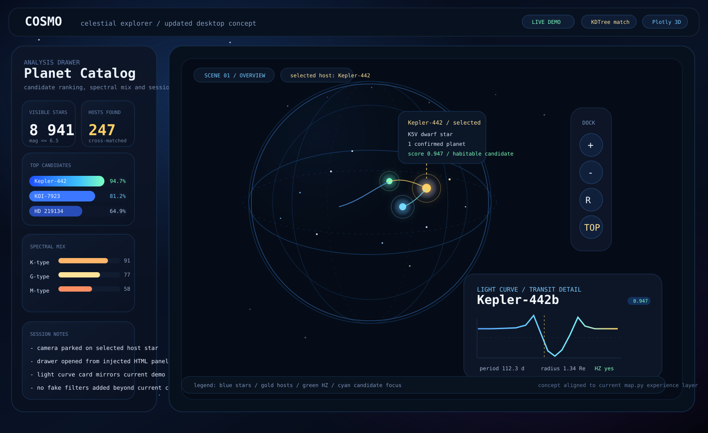
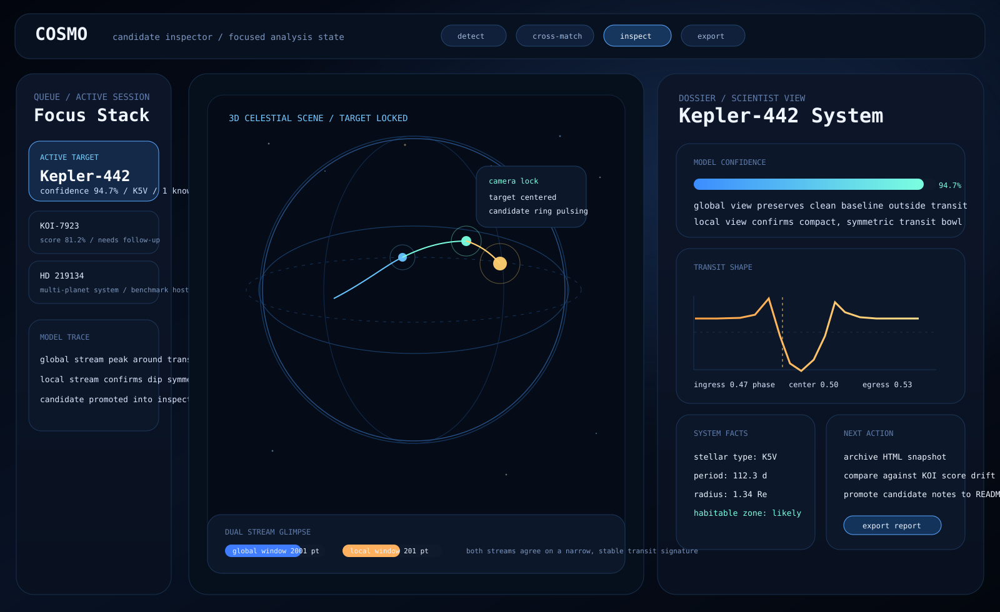
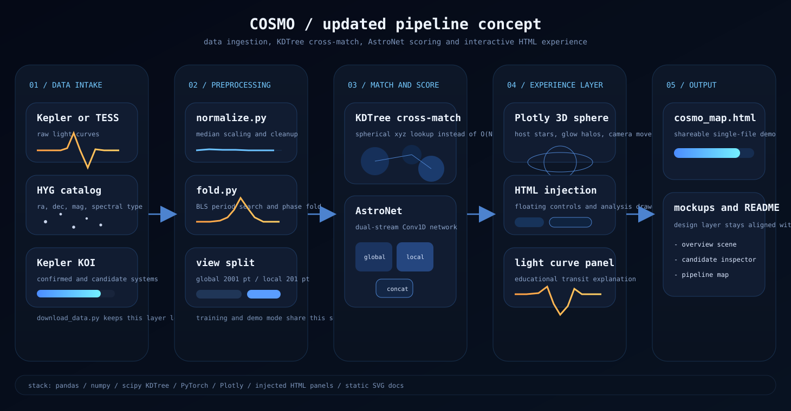

# COSMO - Interactive Exoplanet Atlas

> COSMO combines an AstroNet-style PyTorch CNN with a Plotly 3D celestial sphere to explore exoplanet candidates, confirmed host stars, and transit-shaped light curves from a single shareable HTML output.



---

## What COSMO is today

- A 3D celestial sphere rendered with Plotly, not the older flat sky-map concept.
- A data pipeline that joins visible stars from HYG with Kepler KOI entries.
- A lightweight analysis experience built directly into the generated HTML.
- A documentation layer with updated mockups aligned to the current direction of the project.

## Implemented features

- AstroNet-style dual-stream CNN with a global view (2001 points) and a local view (201 points).
- HYG ingestion filtered to stars with `mag <= 6.5`.
- KOI ingestion filtered to `CONFIRMED` and `CANDIDATE` entries.
- Cross-match on unit-sphere XYZ coordinates using `scipy.spatial.KDTree`.
- Plotly 3D scene with spectral coloring, host-star highlighting, glow halos, and camera presets.
- Didactic light-curve panel that shows an example transit dip.
- Injected HTML controls for zoom, reset, top view, and side view.
- Injected analysis drawer with catalog stats, top candidates, and spectral distribution.
- Demo mode when local datasets are missing.

## Current data snapshot

- Demo mode generates `510` synthetic stars: `10` named bright stars plus `500` random stars.
- Demo mode also marks about `30` synthetic host systems with deterministic scores.
- Real mode downloads about `15 MB` of CSV data into `data/`.
- HYG v3 contributes the full stellar catalog, then COSMO filters to the visible subset used by the UI.
- Kepler KOI data is pulled from the NASA Exoplanet Archive cumulative table.

## Updated mockups



These assets are now part of the repo:

- `mockups/cosmo_sphere_overview_v2.svg` reflects the current 3D UI direction: celestial sphere, analysis drawer, floating controls, and light-curve card.
- `mockups/cosmo_candidate_inspector_v2.svg` shows the next inspection-focused pass of the product, with a richer dossier view for a selected target.
- `mockups/cosmo_pipeline_v2.svg` updates the architecture diagram to include KDTree matching and the injected HTML experience layer.

The overview mockup is intentionally close to the current app. The candidate inspector mockup is a forward-looking design document, not a claim that the full dossier workflow is already wired into the live Plotly output.

---

## Pipeline



```text
Kepler / TESS light curves
  -> normalize.py
  -> fold.py
  -> split into global and local transit windows
  -> AstroNet dual-stream CNN
  -> transit score

HYG star catalog + Kepler KOI catalog
  -> RA/Dec to unit-sphere XYZ
  -> KDTree nearest-neighbour cross-match
  -> host-star overlay on Plotly 3D sphere
  -> injected controls + analysis drawer + exported HTML
```

---

## Quick start

```bash
pip install -r requirements.txt

# Immediate demo, no download required
python atlas/map.py --demo

# Real catalogs
python download_data.py
python atlas/map.py
```

Output: `cosmo_map.html`

---

## Training

```bash
python model/train.py --epochs 30 --batch 64
```

The trained model is saved to `models/astronet_best.pt` and is not committed to git.

---

## Repository structure

```text
cosmo/
|-- atlas/
|   `-- map.py
|-- model/
|   |-- astronet.py
|   `-- train.py
|-- preprocessing/
|   |-- fold.py
|   `-- normalize.py
|-- mockups/
|   |-- cosmo_map_ui.svg
|   |-- cosmo_pipeline.svg
|   |-- cosmo_sphere_overview_v2.svg
|   |-- cosmo_candidate_inspector_v2.svg
|   `-- cosmo_pipeline_v2.svg
|-- download_data.py
|-- requirements.txt
`-- cosmo_map.html
```

---

## AstroNet architecture

Based on Shallue and Vanderburg (2018), adapted to PyTorch.

| Stream | Input | Conv1D blocks | Channels | Flatten output |
|--------|-------|---------------|----------|----------------|
| Global | 2001 pts | 5 | 16 -> 32 -> 64 -> 128 -> 256 | ~2560 |
| Local  | 201 pts  | 2 | 16 -> 32 | ~416 |

Fusion path:

```text
concat -> 4 x Dense(512, ReLU, Dropout 0.5) -> sigmoid
```

---

## Datasets

| Dataset | Role | Source |
|---------|------|--------|
| HYG v3 | Stellar catalog with RA, Dec, magnitude, and spectral class | [astronexus/HYG-Database](https://github.com/astronexus/HYG-Database) |
| Kepler KOI cumulative catalog | Confirmed and candidate exoplanet systems | [NASA Exoplanet Archive](https://exoplanetarchive.ipac.caltech.edu/) |
| Synthetic demo catalog | Offline demo mode for UI and pipeline preview | generated in `atlas/map.py` |

---

## Core dependencies

Main runtime dependencies used by the current pipeline:

- `torch`
- `numpy`
- `pandas`
- `scipy`
- `plotly`
- `astropy`
- `requests`
- `tqdm`

Additional packages remain in `requirements.txt` for the broader experimentation environment.
