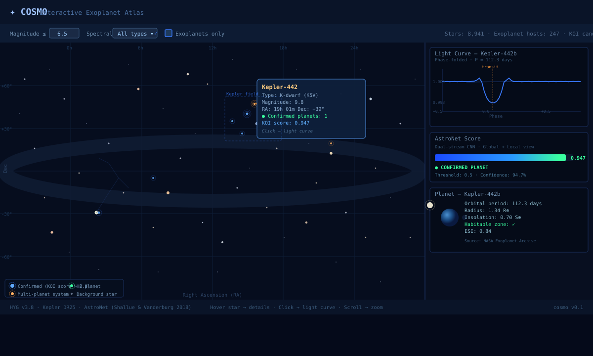
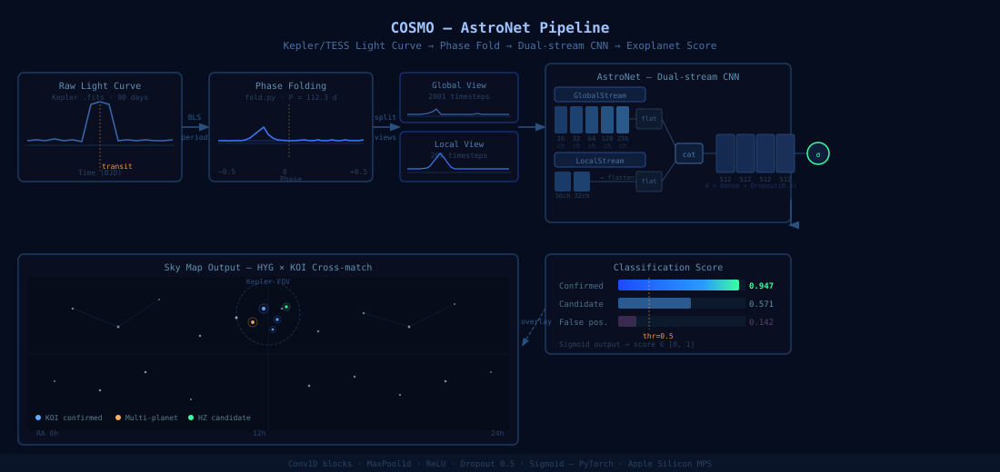

# COSMO — Interactive Exoplanet Atlas

> Atlante stellare interattivo che combina una **CNN PyTorch** per il rilevamento di esopianeti da curve di luce Kepler/TESS con una **mappa del cielo** interattiva.



---

## Features

- **AstroNet dual-stream CNN** — Global view (2001 pts) + Local view (201 pts) → probabilità di transito
- **Mappa del cielo interattiva** (Plotly) — ~9 000 stelle visibili, overlay esopianeti confermati
- **HYG Database** (119 k stelle) × **Kepler KOI** catalog — cross-match RA/Dec automatico
- Hover: nome stella, magnitudine, tipo spettrale, pianeti, KOI score
- Click su stella → curva di luce phase-folded
- Filtri: magnitudine, tipo spettrale, solo sistemi con pianeti

---

## Pipeline



```
Kepler .fits
    ↓  BLS period search
Phase fold  (fold.py)
    ↓  split
Global view (2001 pts) ──┐
                          ├─→ AstroNet CNN ──→ score ∈ [0,1]
Local view   (201 pts) ──┘
                    ↓  cross-match RA/Dec
         HYG catalog × KOI → Plotly sky map
```

---

## Quick Start

```bash
source ~/projects/claude-codex/deepML1/.venv/bin/activate
cd ~/projects/cosmo
pip install -r requirements.txt

# Mappa demo immediata (dati sintetici, nessun download)
python atlas/map.py --demo

# Con dati reali (~15 MB)
python download_data.py
python atlas/map.py
```

Output: `cosmo_map.html` — apri nel browser.

---

## Training CNN

```bash
python model/train.py --epochs 30 --batch 64
```

Il modello addestrato viene salvato in `models/astronet_best.pt` (escluso da git, ~38 MB).

---

## Struttura

```
cosmo/
├── model/
│   ├── astronet.py       ← CNN PyTorch dual-stream (AstroNet)
│   └── train.py          ← training loop + dataset sintetico
├── preprocessing/
│   ├── fold.py           ← phase folding curve di luce
│   └── normalize.py      ← normalizzazione mediana
├── atlas/
│   └── map.py            ← mappa interattiva Plotly
├── mockups/
│   ├── cosmo_map_ui.svg  ← UI mockup
│   └── cosmo_pipeline.svg← pipeline diagram
├── download_data.py      ← scarica HYG + KOI (~15 MB)
├── cosmo_map.html        ← output mappa (generato)
└── data/                 ← dataset (gitignored)
```

---

## AstroNet Architecture

Basata su [Shallue & Vanderburg 2018](https://arxiv.org/abs/1712.05044), adattata per PyTorch.

| Stream | Input | Blocchi Conv1D | Canali | Output flatten |
|--------|-------|----------------|--------|----------------|
| Global | 2001 pts | 5 | 16→32→64→128→256 | ~2560 |
| Local  | 201 pts  | 2 | 16→32             | ~416  |

Fusion: `concat → 4 × Dense(512, ReLU, Dropout 0.5) → sigmoid`

---

## Datasets

| Dataset | Uso | Fonte |
|---------|-----|-------|
| HYG v3.8 | 119 k stelle (RA/Dec/mag/spect) | [astronexus/HYG-Database](https://github.com/astronexus/HYG-Database) |
| Kepler KOI DR25 | 4 034 candidati/confermati | [NASA Exoplanet Archive](https://exoplanetarchive.ipac.caltech.edu/) |
| FER2013 | (deepML1/images) | [zenodo.org/records/11063852](https://zenodo.org/records/11063852) |

---

## Environment

```bash
source ~/projects/claude-codex/deepML1/.venv/bin/activate  # Python 3.9 + PyTorch
```

Dipendenze principali: `torch`, `plotly`, `pandas`, `numpy`, `astropy`
